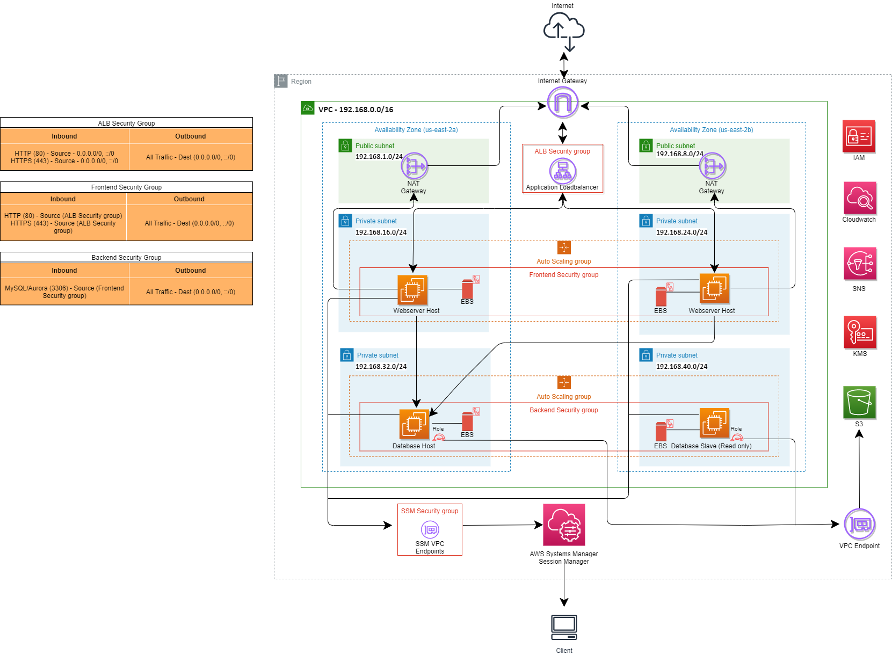

# Create a Web Server platform using AWS EC2 instances via Terraform

Configuration in this directory creates set of resources which may be sufficient for development environment.

We want to have a web application and databases inside AWS using only EC2 instances, all of this using best practices,
this a three tier arquitecture.

Diagram:

<p align="center">
  
</p>

There is a public, private and database subnet created per availability zone in addition to single NAT Gateway shared between all two availability zones.

The instances are in a two autoscaling groups, one for the webserver instances and another for the databases instances.

The instances are fully private, so the System manager session manager is enable to access to the instances.

This configuration uses Availability Zone IDs and Availability Zone names for demonstration purposes. Normally, you need to specify only names or IDs.

## Usage

To run this example you need to execute:

```bash
$ terraform init
$ terraform plan
$ terraform apply
```

## Inputs

Note: CHANGE the aws_ami variable in the dev.tfvars file, with an AMI that includes an Apache server

This repository uses AWS provided modules from [Terraform Module Registry](https://registry.terraform.io/)

### Assumption
- You have installed Terraform version which is >= 1.0.7
- AWS credentials are available at "~/.aws/credentials" which should look like as follows:
```
[default]
aws_access_key_id = <KEY>
aws_secret_access_key = <SECRET>
```
### Clean up
```
terraform show
terraform destroy -force
```
